# How Specification Explicitness Shapes Failure in LLM-Generated Code

This repository is the replication package for the ICSE 2027 paper **“How Specification Explicitness Shapes Failure in LLM-Generated Code.”** It contains the anonymized study data, participant-level artifacts, hidden tests, prompt transcripts, coded prompt datasets, analysis notebooks, generated tables, and figures used to study how specification explicitness affects failure structure, robustness under requirement change, and developer confidence in LLM-assisted development.


## 1. Purpose and relationship to the paper

The artifact supports the paper’s four research questions:

| Research question | Main artifact components |
|---|---|
| **RQ1 — Failure structure** | Phase-I hidden-test outcomes, failure-mode labels, prompt covariates, `RQ1_analysis.ipynb` |
| **RQ2 — Requirement elements** | G2/G3 specification-element indicators, failure-mode maps, prompt-adherence data, `RQ2_analysis.ipynb` |
| **RQ3 — Robustness under change** | Matched Phase-I/Phase-II hidden-test outcomes, pass-to-fail transitions, `RQ3_analysis.ipynb` |
| **RQ4 — Developer calibration** | Predicted performance, observed pass rates, prompt features, mixed-effects analyses, `RQ4_analysis.ipynb` |
| **Supplemental prompt analysis** | Prompt-level labels, participant summaries, prompt–specification adherence, validation samples, plots |

The package supports three levels of use:

1. **Verification:** inspect the included paper-ready CSV files and figures.
2. **Reproduction:** rerun the statistical notebooks from the released processed data.
3. **Reuse:** analyze the anonymized submissions, prompts, tests, and coded process measures for new research questions.

## 2. Target artifact badges

The intended ICSE 2027 badges are:

- **Artifacts Evaluated — Reusable:** the package includes raw and processed data, analysis notebooks, result tables, figures, hidden tests, and documentation intended to support reproduction and reuse.
- **Artifacts Available:** after acceptance, release the package in a permanent archival repository with a DOI and an open license. A private anonymous-review link alone does not qualify for this badge.

The analysis does not require a GPU. The main paper results can be reproduced offline from the included coded datasets. Re-running the LLM-assisted prompt-labeling stage is optional and requires external model access.

## 3. Study at a glance

| Item | Description |
|---|---|
| Participants | 72 |
| Conditions | G1 Unstructured, G2 Structured, G3 Constraint-complete |
| Allocation | 24 participants per condition; 12 per condition–task cell |
| Tasks | Task A: Meeting Slot Suggestion; Task B: Resource Allocation Checker |
| Phases | Phase I: initial development; Phase II: requirement change |
| Hidden tests | 33 task-specific hidden tests per submission |
| Prompt records | 341 in Phase I and 377 in Phase II; 718 total |
| LLM used as part of the study | Free version of ChatGPT-4o |
| Primary language | Python |
| Participant compensation | None |

### Specification conditions

- **G1 — Unstructured:** task description only; participants could use ad hoc prompts.
- **G2 — Structured:** goal, inputs, outputs, Given–When–Then acceptance criteria, constraints, and assumptions.
- **G3 — Constraint-complete:** goal, inputs, outputs, functional requirements, constraints, invariants, negative requirements, edge cases, and tie-breaking rules.

### Requirement changes

- **Task A:** meetings scheduled on Fridays must not start after 15:00.
- **Task B:** at least one resource must remain unallocated after assignment.

## 4. Artifact provenance and repository structure

This package preserves the analysis state used for the submitted manuscript. The participant-level CSV files under `Data/` are the canonical statistical inputs; the notebooks under `Analysis/` generate the paper-facing tables and figures from those inputs. Prompt-level coded CSV files preserve the outputs of the prompt-type and prompt--specification labeling stages, allowing the statistical analyses to be reproduced without calling an external LLM endpoint.

The release should be versioned as an immutable archival snapshot. Record the corresponding Git commit and archival DOI in the release metadata at the top of this README. The included manuscript is located at `paper/How Specification Explicitness Shapes Failure in LLM-Generated Code.pdf`.

### Repository structure

```text
.
├── README.md
├── requirements.txt
├── paper/
│   └── How Specification Explicitness Shapes Failure in LLM-Generated Code.pdf
├── Analysis/
│   ├── demographic/
│   │   ├── demo_analysis.ipynb
│   │   └── results/
│   ├── prompt_analysis/
│   │   ├── prompt_cleaning.ipynb
│   │   ├── prompt_type_labelling and analysis.ipynb
│   │   ├── prompt_specification_alignment.ipynb
│   │   ├── prompt_types_results/
│   │   └── results/
│   └── RQs/
│       ├── RQ1/
│       ├── RQ2/
│       ├── RQ3/
│       └── RQ4/
├── Data/
│   ├── dataset_phase1.csv
│   ├── dataset_phase2.csv
│   ├── RQ1_phase1.csv
│   ├── dataset_phase1_RQ2.csv
│   ├── failure_modes_phase1.csv
│   ├── hidden_tests_phase1.csv
│   ├── demographic/
│   ├── failure_mode_maps/
│   ├── prompt_data/
│   └── raw_data/
├── Hidden_tests/
│   ├── hidden_tests_TaskA.py
│   └── hidden_tests_TaskB.py
└── auxiliray/
    └── run_tests.py
```

Generated outputs are retained alongside their notebooks so reviewers can compare regenerated files with the archived results.

## 5. Data inventory

### 5.1 Core participant-level datasets

| Path | Shape | Description |
|---|---:|---|
| `Data/dataset_phase1.csv` | 72 × 30 | Phase-I condition/task assignments, specification elements, hidden-test outcomes, survey responses, confidence |
| `Data/dataset_phase2.csv` | 72 × 31 | Phase-II updated specification elements, hidden-test outcomes, change/impact responses, confidence |
| `Data/RQ1_phase1.csv` | 72 × 14 | Analysis-ready RQ1 dataset with skill, familiarity, prompt effort, alignment, correctness, and diversity |
| `Data/dataset_phase1_RQ2.csv` | 72 × 30 | Phase-I dataset used to construct the G2/G3 RQ2 analysis |
| `Data/failure_modes_phase1.csv` | 72 × 6 | Participant-level passed and failed failure-mode categories |
| `Data/hidden_tests_phase1.csv` | 72 × 8 | Phase-I passed/failed hidden-test identifiers and counts |
| `Data/demographic/questionnair.csv` | 72 × 5 | Anonymized demographic and experience responses |

Participant identifiers use the format `S0001`–`S0072`. 

### 5.2 Raw participant artifacts

`Data/raw_data/Phase1_raw/` and `Data/raw_data/Phase2_raw/` contain one directory per participant. Depending on the submission, a directory includes:

```text
Sxxxx/
├── docs/
│   ├── LLM_transcript.json
│   └── LLM_transcript.txt
├── src/
│   └── solution.py
└── tests/
    └── test_solution.py
```

Some participant repositories used slightly different test-file locations. The analysis relies on the normalized participant-level CSV files, not on a fixed participant directory layout.

### 5.3 Hidden tests and failure taxonomy

- `Hidden_tests/hidden_tests_TaskA.py`
- `Hidden_tests/hidden_tests_TaskB.py`
- `Data/failure_mode_maps/hidden_test_failure_mode_labels_TaskA.json`
- `Data/failure_mode_maps/hidden_test_failure_mode_labels_TaskB.json`

Failure classes used in the paper are:

| Paper abbreviation | Meaning |
|---|---|
| CO | Constraint omission |
| IV | Invariant violation |
| TB | Tie-breaking failure |
| EC | Edge-case failure |
| UA | Unsupported assumption |

Some intermediate CSV files use the legacy abbreviation `AI` for assumption injection. In the paper and this README, that category is reported as **UA (unsupported assumption)**.

#### Hidden-test distribution across failure classes

Each task contains 33 executable hidden-test cases, but the cases are intentionally distributed unevenly across the five semantic failure classes. Task A's parameterized duration test contributes four executable UA cases, so its 30 test functions expand to 33 test cases during execution.

| Task | CO | IV | TB | EC | UA | Total |
|---|---:|---:|---:|---:|---:|---:|
| Task A — Meeting Slot Suggestion | 9 | 5 | 1 | 9 | 9 | 33 |
| Task B — Resource Allocation Checker | 14 | 4 | 0 | 6 | 9 | 33 |


> **Important: the failure-mode percentages reported in the paper are normalized, not raw failure counts.** For participant \(i\), assigned task \(k\), and failure class \(c\), the analysis computes
>
> \[
> \mathrm{NormalizedFailure}_{i,c}
> =
> \frac{\#\text{ failed hidden-test cases in class }c}
> {\#\text{ hidden-test cases in class }c\text{ for task }k}.
> \]
>
> This normalization is necessary because the classes contain different numbers of hidden tests and because the class distribution differs across Tasks A and B. It ensures that a class with more tests, such as CO in Task B, does not mechanically produce a larger failure value. For Task B, no hidden test is labeled TB; its TB denominator is therefore zero, and Task-B observations are treated as undefined for that class rather than as successful tie-breaking tests.


### 5.4 Prompt datasets

| Path | Shape | Description |
|---|---:|---|
| `Data/prompt_data/Phase1_prompt_type.csv` | 341 × 33 | Phase-I prompt-level text, metadata, and prompt-type labels |
| `Data/prompt_data/Phase2_prompt_type.csv` | 377 × 36 | Phase-II prompt-level text, metadata, and prompt-type labels |
| `Data/prompt_data/Phase1_prompt_summary.csv` | 70 × 8 | Participant-level Phase-I prompt effort and type counts |
| `Data/prompt_data/Phase2_prompt_summary.csv` | 72 × 8 | Participant-level Phase-II prompt effort and type counts |
| `Data/prompt_data/Phase1_prompts_spec_align.csv` | 226 × 13 | G2/G3 Phase-I prompt-level specification-use labels |
| `Data/prompt_data/Phase2_prompts_spec_align.csv` | 235 × 19 | G2/G3 Phase-II prompt-level specification-use labels |
| `Data/prompt_data/Phase1_spec_alignment_summary.csv` | 47 × 18 | Participant-level Phase-I adherence summaries |
| `Data/prompt_data/Phase2_spec_alignment_summary.csv` | 48 × 18 | Participant-level Phase-II adherence summaries |
| `Data/prompt_data/combined_prompt_type_manual_labeling.csv` | 80 × 9 | Manual validation sample for prompt types |
| `Data/prompt_data/combined_spec_alignment_sample_for_manual_labeling.csv` | 67 × 15 | Manual audit sample for specification-use labels |

The Phase-I prompt summary contains 70 participants because two submissions did not yield extractable prompt records in the normalized prompt dataset. Phase II contains all 72 participants.

## 6. Measures

### 6.1 Correctness

Each submission was evaluated against 33 hidden tests.

- `failure_count`: number of failed hidden tests.
- `passed_tests`: number of passed hidden tests.
- `full_correctness`: one when all 33 tests pass, zero otherwise.

### 6.2 Failure structure

For participant \(i\) and failure class \(c\):

- class-specific failure count;
- class occurrence, indicating at least one failure;
- normalized class frequency, dividing failures by the number of tests assigned to the class;
- failure-mode diversity, the number of distinct classes with at least one failure.

### 6.3 Requirement elements

RQ2 codes the presence of:

- functional requirements;
- invariants;
- negative requirements;
- constraints;
- acceptance criteria;
- exception handling;
- tie-breaking rules.

Requirement–failure contrasts are risk differences. Positive values indicate lower failure occurrence when an element is present.

### 6.4 Robustness under requirement change

A regression is a hidden test that passed in Phase I and failed in Phase II.

- `regression_occurrence`: whether any pass-to-fail transition occurred.
- `regression_severity`: number of pass-to-fail transitions.
- `regression_rate`: regressions divided by the number of Phase-I passing tests.

### 6.5 Developer calibration

Participants predicted hidden-test performance on a five-point scale. Responses were mapped to percentage-range midpoints and compared with observed pass rate.

```text
signed calibration gap = predicted performance − observed performance
```

Positive values indicate overconfidence and negative values indicate underconfidence.

### 6.6 Prompt effort and prompt purpose

Participant-level prompt measures include:

- `total_prompt_count`;
- `total_prompt_len`, the total prompt-word volume per participant;
- `average_prompt_len`;
- `clarification_count`;
- `debugging_count`;
- `code_generation_count`;
- `test_generation_count`.

Prompt types are:

- **Clarification:** asks for explanation, interpretation, or requirement clarification.
- **Debugging:** diagnoses or repairs an observed failure.
- **Code generation:** requests implementation or modification of code.
- **Test generation:** requests tests, test updates, or test-like acceptance checks.

### 6.7 Prompt–specification adherence

For G2/G3, prompt-level labels capture whether participants:

- explicitly referred to the specification;
- carried constraints from the specification;
- carried edge cases from the specification;
- asked the model to preserve invariants;
- asked for tests grounded in the specification;
- omitted important specification elements.

The participant-level adherence score is the proportion of specified elements referenced at least once in the participant's prompts. The omission rate is the proportion of specified elements that were never referenced.

## 7. System requirements

### Hardware

- CPU: any recent 64-bit processor
- RAM: 8 GB minimum; 16 GB recommended
- Disk: approximately 1 GB free space
- GPU: not required
- Network: not required for reproducing the paper analyses from the released coded datasets

### Software

- Python 3.10 or later
- Jupyter / `nbconvert`
- A POSIX shell for the commands below, or equivalent PowerShell commands

Install the offline analysis dependencies:

```bash
python -m venv .venv
source .venv/bin/activate          # Windows: .venv\Scripts\activate
python -m pip install --upgrade pip
python -m pip install \
  jupyterlab nbconvert ipykernel \
  numpy pandas scipy statsmodels patsy \
  matplotlib scikit-learn tqdm pytest pyprojroot
```

Optional, only for re-running LLM-based prompt labeling:

```bash
python -m pip install groq
export GROQ_API_KEY="YOUR_KEY"
```

The released labels and summaries are already included, so external API access is not needed to reproduce the paper’s statistics.

## 8. Setup

1. Download or clone the artifact.
2. Enter the repository root.
3. Create and activate the Python environment described above.
4. Create a lowercase alias for `Data`. The RQ1 notebook searches for a folder named `data`, while the archive uses `Data`.


## 9. Quick verification

The following command checks the principal paper-facing outputs without rerunning the notebooks. file included in the repo `quick_test.py`:

```bash
python - <<'PY'
from pathlib import Path
import numpy as np
import pandas as pd

root = Path(".")

rq1 = pd.read_csv(
    root / "Analysis/RQs/RQ1/rq1_outputs/rq1_paper_main_table.csv"
)
assert np.allclose(
    rq1["Failure count, mean (SD)"].str.extract(r"([0-9.]+)")[0].astype(float),
    [21.54, 19.67, 11.38],
    atol=0.01,
)

rq2 = pd.read_csv(
    root / "Analysis/RQs/RQ2/rq2_outputs/tables/"
           "rq2_requirement_predictive_power_success_odds.csv"
)
expected_or = {
    "Functional Requirements": 2.80,
    "Invariants": 2.62,
    "Negative Requirements": 2.62,
    "Tie-Breaking Rules": 1.99,
}
for label, expected in expected_or.items():
    observed = rq2.loc[rq2["label"] == label, "odds_ratio"].iloc[0]
    assert np.isclose(observed, expected, atol=0.02)

rq3 = pd.read_csv(
    root / "Analysis/RQs/RQ3/rq3_outputs/rq3_compact_table.csv"
)
assert rq3["Any regression"].tolist() == [
    "2/24 (8.3%)", "2/24 (8.3%)", "4/24 (16.7%)"
]

rq4 = pd.read_csv(
    root / "Analysis/RQs/RQ4/rq4_outputs/tables/"
           "rq4_descriptive_calibration_by_phase_spec.csv"
)
observed = rq4["overconfidence_pp_mean"].round(2).tolist()
expected = [22.78, 5.65, -22.20, 22.73, -17.43, -18.22]
assert np.allclose(observed, expected, atol=0.02)

p1 = pd.read_csv(root / "Data/prompt_data/Phase1_prompt_type.csv")
p2 = pd.read_csv(root / "Data/prompt_data/Phase2_prompt_type.csv")
assert len(p1) == 341 and len(p2) == 377

print("Artifact verification passed.")
PY
```

Expected output:

```text
Artifact verification passed.
```

## 10. Reproducing the analyses

The archived output CSV and figure files are the reference outputs. To avoid modifying the original notebooks, `nbconvert` writes an executed copy while the notebooks regenerate tables and figures in their local output directories.

### 10.1 Demographics

```bash
cd Analysis/demographic
jupyter nbconvert \
  --to notebook --execute demo_analysis.ipynb \
  --output demo_analysis.executed.ipynb \
  --ExecutePreprocessor.timeout=900
cd ../..
```

Expected outputs: `Analysis/demographic/results/`.

### 10.2 RQ1 — Correctness and failure structure

```bash
cd Analysis/RQs/RQ1
jupyter nbconvert \
  --to notebook --execute RQ1_analysis.ipynb \
  --output RQ1_analysis.executed.ipynb \
  --ExecutePreprocessor.timeout=1800
cd ../../..
```

The notebook uses random seed `2026` and 1,000 bootstrap resamples. It regenerates `Analysis/RQs/RQ1/rq1_outputs/` and `img/RQ1_boxplot_final.pdf`.

Principal checkpoints:

- mean failures: G1 21.54, G2 19.67, G3 11.38;
- full correctness: one G3 submission, 4.17%;
- failure-count ANOVA: \(F(2,69)=26.77\), \(p<.001\), partial \(\eta_p^2=.44\);
- failure-diversity ANOVA: \(F(2,69)=10.46\), \(p<.001\), partial \(\eta_p^2=.23\);
- adjusted G3 vs G1 IRR: 0.48, 95% CI [0.24, 0.93].

### 10.3 RQ2 — Requirement elements and failure reduction

```bash
cd Analysis/RQs/RQ2
jupyter nbconvert \
  --to notebook --execute RQ2_analysis.ipynb \
  --output RQ2_analysis.executed.ipynb \
  --ExecutePreprocessor.timeout=1200
cd ../../..
```

Expected outputs: `Analysis/RQs/RQ2/rq2_outputs/`.

Principal success-odds checkpoints:

| Requirement element | OR | 95% CI | BH-adjusted p |
|---|---:|---:|---:|
| Functional requirements | 2.80 | [2.29, 3.44] | < .001 |
| Invariants | 2.62 | [2.14, 3.21] | < .001 |
| Negative requirements | 2.62 | [2.14, 3.21] | < .001 |
| Tie-breaking rules | 1.99 | [1.62, 2.44] | < .001 |
| Exception handling | 1.48 | [1.20, 1.83] | < .001 |
| Constraints | 1.36 | [0.68, 2.72] | .384 |
| Acceptance criteria | 0.37 | [0.30, 0.45] | < .001 |

### 10.4 RQ3 — Robustness under requirement change

Primary analysis:

```bash
cd Analysis/RQs/RQ3
jupyter nbconvert \
  --to notebook --execute RQ3_analysis.ipynb \
  --output RQ3_analysis.executed.ipynb \
  --ExecutePreprocessor.timeout=1200
```

Expanded covariate and sensitivity analyses:

```bash
jupyter nbconvert \
  --to notebook --execute RQ3_analysis_with_covariates.ipynb \
  --output RQ3_analysis_with_covariates.executed.ipynb \
  --ExecutePreprocessor.timeout=1200
cd ../../..
```

Expected outputs:

- `Analysis/RQs/RQ3/rq3_outputs/`
- `Analysis/RQs/RQ3/rq3_outputs_covariates/`

Principal checkpoints:

| Condition | Any regression | Mean severity | Mean regression rate |
|---|---:|---:|---:|
| G1 | 2/24 (8.3%) | 0.08 | 0.58% |
| G2 | 2/24 (8.3%) | 0.38 | 2.38% |
| G3 | 4/24 (16.7%) | 0.17 | 0.70% |

Task-adjusted occurrence estimates are G2 vs G1 OR = 1.00 and G3 vs G1 OR = 2.22.

### 10.5 RQ4 — Developer calibration

```bash
cd Analysis/RQs/RQ4
jupyter nbconvert \
  --to notebook --execute RQ4_analysis.ipynb \
  --output RQ4_analysis.executed.ipynb \
  --ExecutePreprocessor.timeout=1200
cd ../../..
```

Expected outputs: `Analysis/RQs/RQ4/rq4_outputs/`.

Principal signed calibration gaps in percentage points:

| Condition | Phase I | Phase II |
|---|---:|---:|
| G1 | 22.78 | 22.73 |
| G2 | 5.65 | −17.43 |
| G3 | −22.20 | −18.22 |

The primary mixed model includes condition, phase, their interaction, task, and a participant random intercept. The supplemental experience-adjusted analysis additionally includes Python skill and LLM familiarity.

### 10.6 Prompt processing and labeling

The prompt-analysis notebooks document cleaning, automated labeling, validation, aggregation, and visualization:

- `Analysis/prompt_analysis/prompt_cleaning.ipynb`
- `Analysis/prompt_analysis/prompt_type_labelling and analysis.ipynb`
- `Analysis/prompt_analysis/prompt_specification_alignment.ipynb`

For ordinary reproduction, use the released prompt-level and participant-level CSV files. Do **not** rerun external model calls unless the goal is to reproduce the labeling stage. Model outputs can change over time because of API and model-version changes.

## 11. Mapping paper tables and figures to artifact outputs

| Paper item | Artifact output |
|---|---|
| Fig. 5 participant demographics | `Analysis/demographic/results/demo_python.pdf`, `demo_llm_use.pdf` |
| Table I RQ1 main results | `Analysis/RQs/RQ1/rq1_outputs/rq1_paper_main_table.csv` |
| Fig. 6 RQ1 distributions | `Analysis/RQs/RQ1/img/RQ1_boxplot_final.pdf` |
| Supplemental hidden-test class distribution and normalization denominators | `Analysis/RQs/RQ1/rq1_outputs/figures/failure_mode_hidden_test_distribution.png` and the failure-mode maps under `Data/failure_mode_maps/` |
| Table II requirement-element models | `Analysis/RQs/RQ2/rq2_outputs/tables/rq2_requirement_predictive_power_success_odds.csv` |
| Fig. 7 requirement–failure heatmap | `Analysis/RQs/RQ2/rq2_outputs/figures/rq2_requirement_failure_heatmap_g2g3_original_palette.pdf` |
| Table III regression profile | `Analysis/RQs/RQ3/rq3_outputs/rq3_compact_table.csv` |
| Table IV calibration | `Analysis/RQs/RQ4/rq4_outputs/tables/rq4_descriptive_calibration_by_phase_spec.csv` and `rq4_mixed_model_coefficients.csv` |
| Table V specification reuse | `Analysis/RQs/RQ1/rq1_outputs/rq1_g2g3_alignment_descriptives.csv` and `rq1_g2g3_alignment_high_low_nb_irr.csv` |
| Fig. 8 adherence vs pass rate | `Analysis/RQs/RQ2/rq2_outputs/figures/rq2_alignment_vs_pass_rate_g2g3.pdf` |

## 12. Detailed supplemental prompt analysis

This section reports the extended prompt analyses retained in the artifact but summarized only briefly in the paper.

### 12.1 Prompt-type validation

As reported in the paper, prompt types were generated with `openai/gpt-oss-120b` and validated by two authors on a stratified sample, yielding substantial agreement (Cohen's \(\kappa=0.81\)). The released manual-validation file contains 80 prompt records; overall agreement in that file is 86.25%.

| Manual \ Model | Clarification | Code generation | Debugging | Test generation |
|---|---:|---:|---:|---:|
| Clarification | 25 | 3 | 2 | 4 |
| Code generation | 0 | 22 | 0 | 1 |
| Debugging | 1 | 0 | 9 | 0 |
| Test generation | 0 | 0 | 0 | 13 |

For prompt--specification adherence, two annotators coded a development sample for reuse or omission of constraints, edge cases, invariants, and test obligations. These labels were used to tune the classifier, and a separate audit achieved 75.12% agreement with manual labels. The released manual-audit CSV contains the prompt records and coded decisions used to inspect this stage.

### 12.2 Prompt effort by phase

`total_prompt_len` is the participant’s total prompt-word volume. `average_prompt_len` is the mean words per prompt for that participant.

| Phase | Participants with summary | Total prompts | Mean prompts | Mean total words | Mean prompt length | Clarification | Debugging | Code generation | Test generation |
|---|---:|---:|---:|---:|---:|---:|---:|---:|---:|
| Phase I | 70 | 341 | 4.87 | 598.60 | 136.69 | 1.50 | 0.94 | 1.51 | 0.91 |
| Phase II | 72 | 377 | 5.24 | 937.06 | 248.23 | 1.75 | 0.46 | 2.01 | 1.01 |

Prompt volume increased after the requirement change. Code-generation prompts increased, while debugging prompts decreased.

#### Phase-by-phase prompt-effort distributions

The following notched boxplots show the participant-level distributions rather than only the means in the table. Each figure places Phase I and Phase II side by side and preserves the same condition colors used throughout the prompt analysis.

<table>
<tr>
<td width="50%"><strong>Total prompt count</strong><br>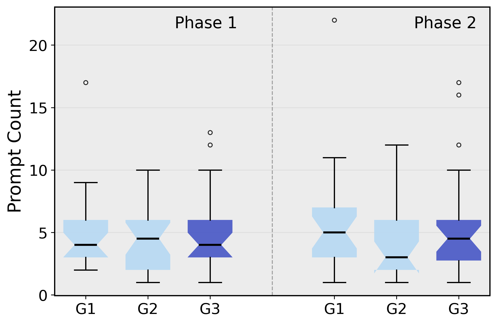</td>
<td width="50%"><strong>Total prompt-word volume</strong><br>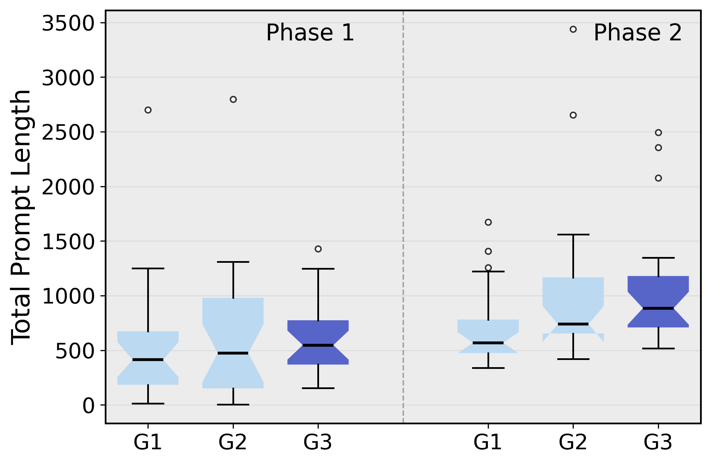</td>
</tr>
</table>


### 12.3 Prompt effort by condition and phase

Values are participant-level means.

| Phase | Condition | n | Prompts | Total words | Prompt length | Clarification | Debugging | Code generation | Test generation |
|---|---|---:|---:|---:|---:|---:|---:|---:|---:|
| Phase I | G1 | 23 | 5.00 | 535.96 | 108.86 | 1.57 | 1.22 | 0.96 | 1.26 |
| Phase I | G2 | 24 | 4.46 | 648.38 | 141.65 | 1.17 | 1.04 | 1.38 | 0.88 |
| Phase I | G3 | 23 | 5.17 | 609.30 | 159.34 | 1.78 | 0.57 | 2.22 | 0.61 |
| Phase II | G1 | 24 | 5.92 | 715.38 | 170.46 | 2.29 | 0.62 | 1.71 | 1.29 |
| Phase II | G2 | 24 | 4.25 | 1030.00 | 311.21 | 1.33 | 0.29 | 1.71 | 0.92 |
| Phase II | G3 | 24 | 5.54 | 1065.79 | 263.02 | 1.62 | 0.46 | 2.62 | 0.83 |

Across phases, G3 used fewer debugging prompts and more code-generation prompts than the other conditions.

### 12.4 Prompt-type composition

Cells are percentages of all prompts in the corresponding condition and phase.

| Phase | Condition | Clarification | Code generation | Debugging | Test generation |
|---|---|---:|---:|---:|---:|
| Phase I | G1 | 31.3% | 19.1% | 24.3% | 25.2% |
| Phase I | G2 | 26.2% | 30.8% | 23.4% | 19.6% |
| Phase I | G3 | 34.5% | 42.9% | 10.9% | 11.8% |
| Phase II | G1 | 38.7% | 28.9% | 10.6% | 21.8% |
| Phase II | G2 | 31.4% | 40.2% | 6.9% | 21.6% |
| Phase II | G3 | 29.3% | 47.4% | 8.3% | 15.0% |

Across all conditions, the phase-level composition changed from 30.8% clarification, 31.1% code generation, 19.4% debugging, and 18.8% test generation in Phase I to 33.4%, 38.5%, 8.8%, and 19.4%, respectively, in Phase II.

#### Prompt-type distributions by condition and phase

These plots complement the percentage table by showing the participant-level spread, medians, notches, whiskers, and outliers for each prompt purpose.

<table>
<tr>
<td width="50%"><strong>Clarification prompts</strong><br>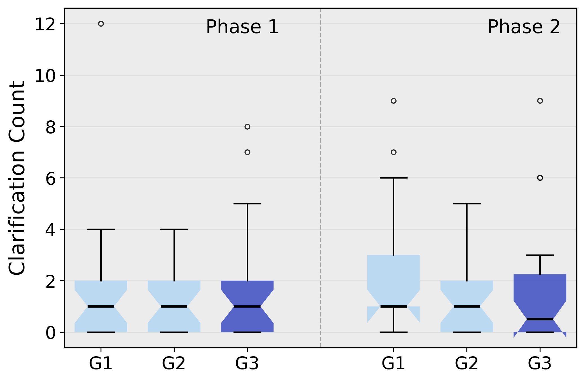</td>
<td width="50%"><strong>Code-generation prompts</strong><br>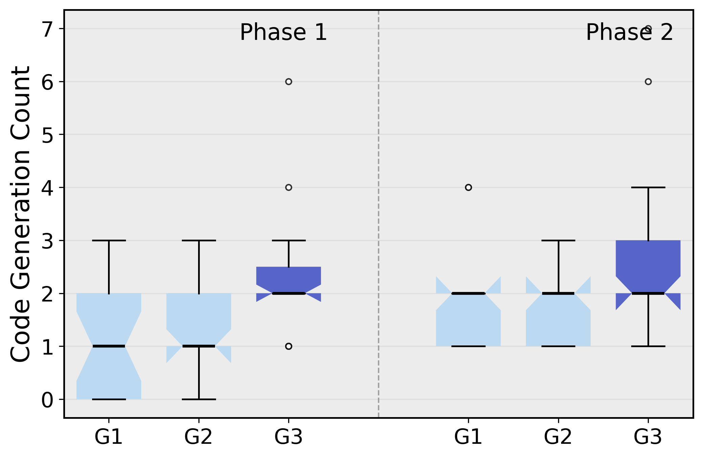</td>
</tr>
<tr>
<td width="50%"><strong>Debugging prompts</strong><br>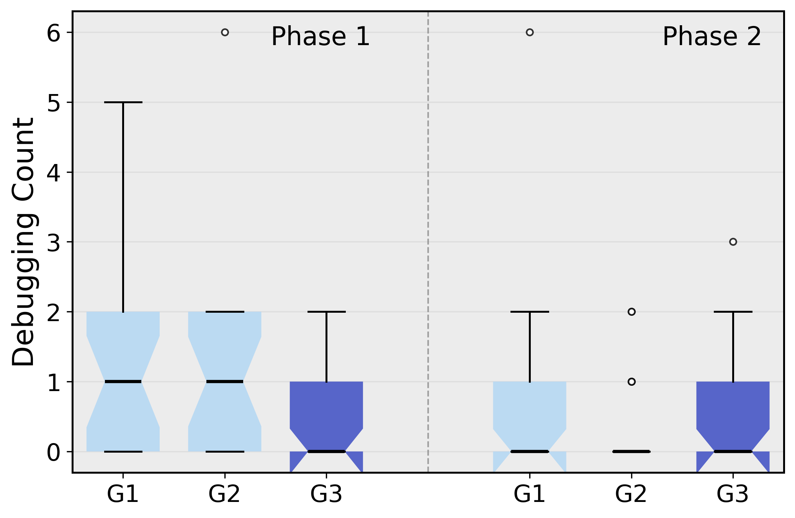</td>
<td width="50%"><strong>Test-generation prompts</strong><br>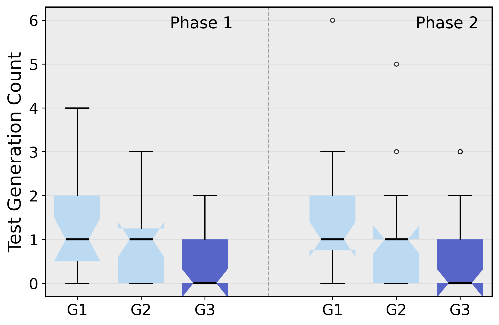</td>
</tr>
</table>


### 12.5 Prompt–specification adherence by phase and condition

Adherence is available for G2/G3 only. Counts under the behavioral columns are mean occurrences per participant; adherence and omission are proportions.

| Phase | Condition | n | Adherence | Omission | Explicit reference | Constraints | Edge cases | Preserve invariants | Specification-based tests |
|---|---|---:|---:|---:|---:|---:|---:|---:|---:|
| Phase I | G2 | 24 | 0.448 | 0.552 | 0.583 | 1.833 | 1.583 | 0.042 | 0.458 |
| Phase I | G3 | 23 | 0.598 | 0.402 | 1.391 | 1.739 | 1.348 | 0.522 | 0.435 |
| Phase II | G2 | 24 | 0.875 | 0.125 | 1.333 | 1.917 | 1.500 | 0.833 | 1.542 |
| Phase II | G3 | 24 | 0.854 | 0.146 | 2.000 | 2.625 | 2.125 | 0.917 | 1.625 |

During initial development, mean adherence was 45% in G2 and 60% in G3, matching the paper. Adherence rose substantially after the requirement change in both conditions.

#### Prompt--specification adherence distributions

The plots below show how specification use changed from initial development to the requirement-change phase. They include both the aggregate adherence measures and the individual behaviors from which adherence was derived.

<table>
<tr>
<td width="50%"><strong>Adherence score</strong><br>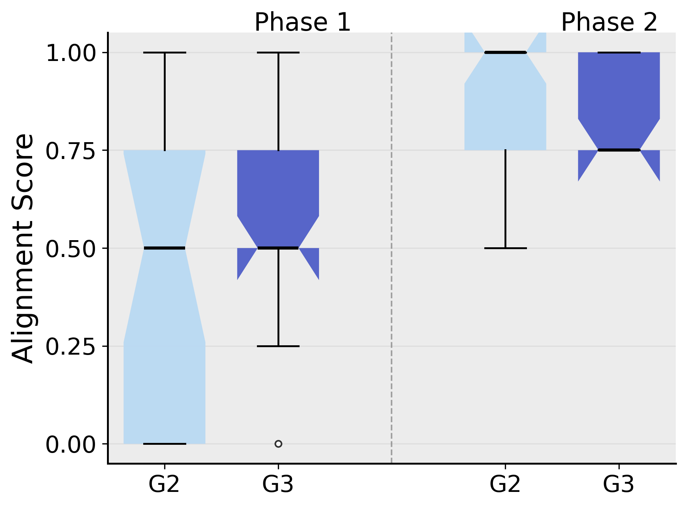</td>
<td width="50%"><strong>Omission rate</strong><br>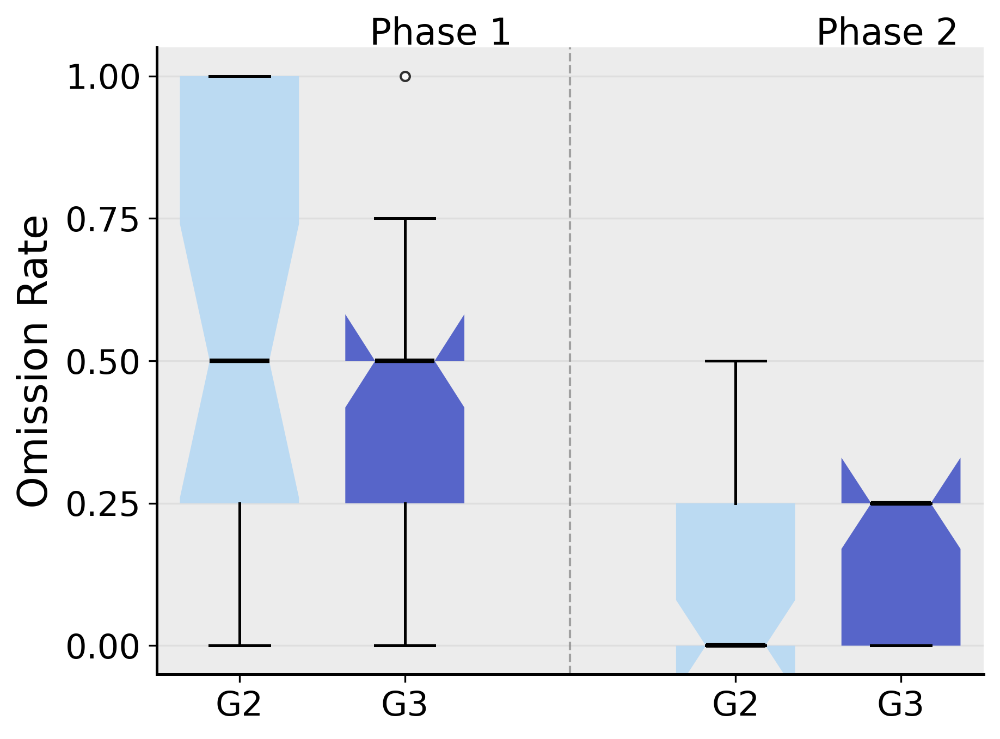</td>
</tr>
<tr>
<td width="50%"><strong>Explicit specification references</strong><br>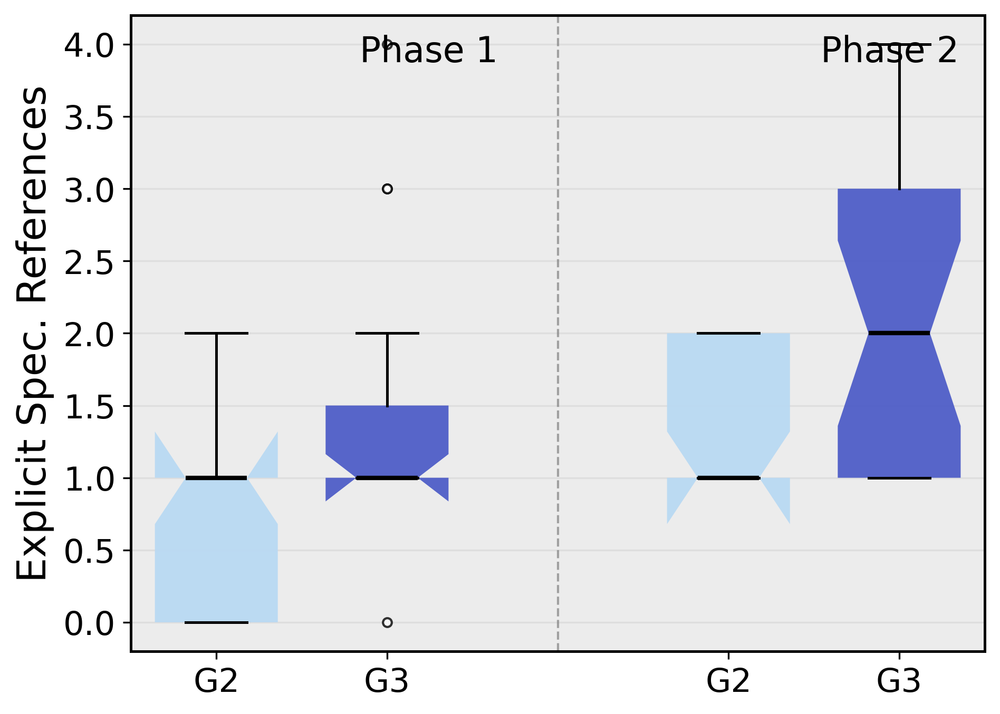</td>
<td width="50%"><strong>Constraints carried into prompts</strong><br>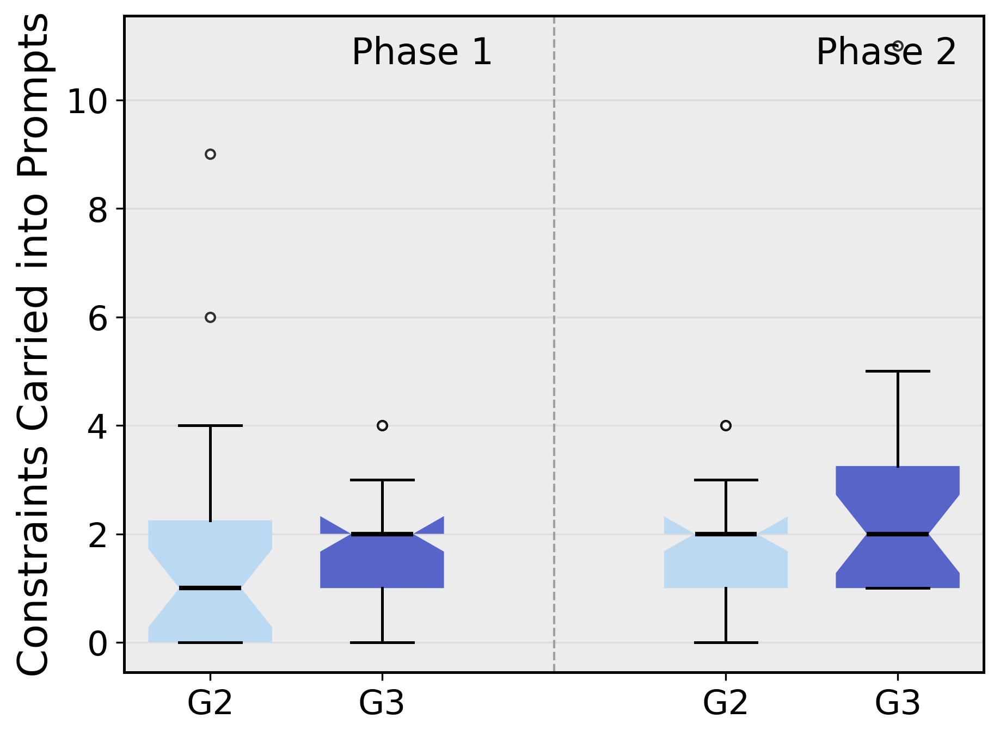</td>
</tr>
<tr>
<td width="50%"><strong>Edge cases carried into prompts</strong><br>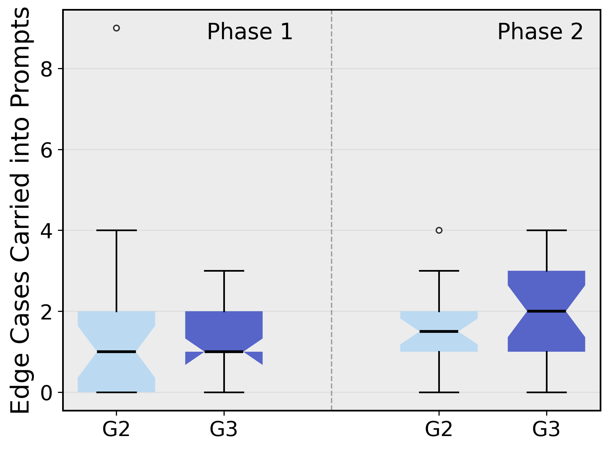</td>
<td width="50%"><strong>Requests to preserve invariants</strong><br>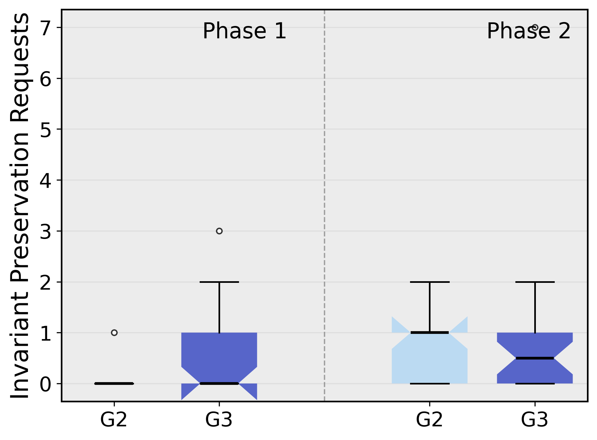</td>
</tr>
<tr>
<td width="50%"><strong>Specification-grounded test requests</strong><br>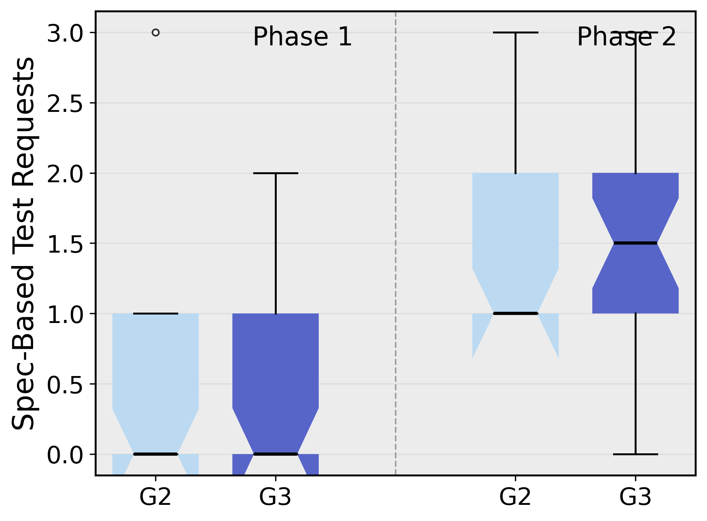</td>
<td width="50%"><strong>Prompts omitting important elements</strong><br>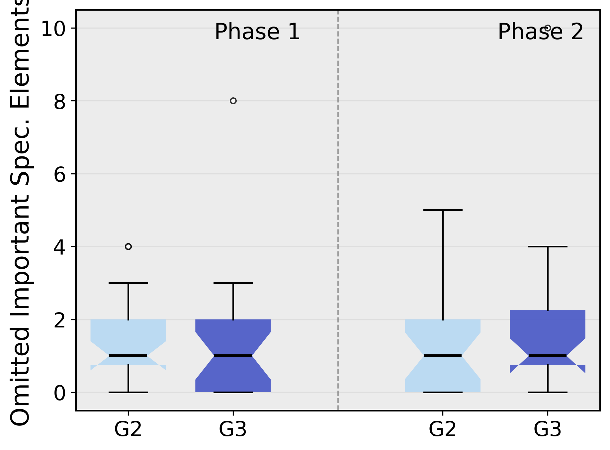</td>
</tr>
</table>


### 12.6 Prompt variables and outcomes

The following are supplemental, exploratory analyses.

#### RQ1 failure outcomes

| Prompt behavior | Outcome | Estimate | 95% CI | p | Holm p |
|---|---|---:|---:|---:|---:|
| Constraints carried into prompts | Normalized CO failures | −0.144 | [−0.347, 0.060] | .166 | .499 |
| Edge cases carried into prompts | Normalized EC failures | −0.069 | [−0.193, 0.055] | .276 | .551 |
| Specification-based tests requested | Total failure count, IRR | 1.145 | [0.551, 2.378] | .717 | .717 |

These targeted prompt variables did not provide statistically conclusive explanations for the condition-level RQ1 effect.

#### RQ2 correctness and adherence

Within G2/G3 during Phase I:

- Overall adherence and pass rate: Spearman \(\rho=.199\), \(p=.181\), BH-adjusted \(p=.361\).
- Explicitly referring to the specification and pass rate: \(\rho=.631\), \(p<.001\), BH-adjusted \(p<.001\).
- Asking to preserve invariants and pass rate: \(\rho=.338\), \(p=.020\), BH-adjusted \(p=.081\).
- Debugging count and pass rate: \(\rho=-.236\), \(p=.110\), BH-adjusted \(p=.439\).

The median-split analysis reported in the paper found:

| Reuse group | n | Mean adherence | Mean failures | Failure diversity |
|---|---:|---:|---:|---:|
| Lower reuse | 13 | 0.091 | 19.46 | 3.85 |
| Higher reuse | 35 | 0.671 | 14.06 | 3.51 |

The adjusted higher-vs-lower reuse effect was IRR = 0.76, 95% CI [0.32, 1.83], \(p=.543\).

#### RQ3 regressions

Prompt effort and adherence did not explain the regression frequency–severity profile. The largest absolute Spearman correlation among the primary prompt-effort variables and regression outcomes was approximately .11. Within G2/G3, Phase-II adherence correlated \(\rho=.139\) with regression severity (\(p=.347\)) and \(\rho=.133\) with regression rate (\(p=.374\)).

#### RQ4 calibration

Prompt-effort sensitivity models were adjusted for condition, phase, task, Python skill, and LLM familiarity.

| Predictor, per 1 SD | Signed-gap estimate | 95% CI | p | FDR p |
|---|---:|---:|---:|---:|
| Prompt count | −4.07 | [−8.80, 0.66] | .092 | 1.000 |
| Total prompt volume | −1.38 | [−6.43, 3.67] | .592 | 1.000 |
| Average prompt length | 3.45 | [−2.38, 9.28] | .246 | 1.000 |
| Clarification count | −5.35 | [−10.35, −0.35] | .036 | 1.000 |
| Debugging count | 0.58 | [−3.22, 4.38] | .765 | 1.000 |
| Code-generation count | −3.57 | [−11.16, 4.02] | .356 | 1.000 |
| Test-generation count | −0.45 | [−4.27, 3.38] | .819 | 1.000 |

No prompt-effort or prompt-type predictor remained significant after correction. Within G2/G3, a one-unit increase in adherence was associated with a 7.77-percentage-point lower signed calibration gap, 95% CI [−14.65, −0.89], \(p=.027\).

## 13. Running hidden tests on an individual submission

The following example evaluates one Task-A Phase-I solution in an isolated temporary directory:

```bash
tmpdir="$(mktemp -d)"
cp Data/raw_data/Phase1_raw/S0001/src/solution.py "$tmpdir/solution.py"
cp Hidden_tests/hidden_tests_TaskA.py "$tmpdir/test_hidden.py"
(
  cd "$tmpdir"
  python -m pytest -q test_hidden.py
)
rm -rf "$tmpdir"
```

For Task B, replace the participant with a Task-B participant and copy `hidden_tests_TaskB.py`. Determine task assignment from `Data/dataset_phase1.csv`.

Participant repositories vary in their local test-file layout. Copying `solution.py` and the relevant hidden test into a temporary directory avoids import-path conflicts.

## 14. Expected runtime and reproducibility notes

- Quick verification: under one minute.
- RQ2–RQ4 notebooks: typically a few minutes each on a modern laptop.
- RQ1: longest analysis because of bootstrap confidence intervals; allow up to 30 minutes.
- Full offline reproduction: approximately 20–60 minutes depending on hardware and plotting backend.
- Small floating-point differences can occur across Python, SciPy, and Statsmodels versions.
- Bootstrap intervals should be stable because RQ1 uses random seed 2026.
- External LLM relabeling is not bit-for-bit reproducible because model endpoints can change; the released coded CSVs are the canonical inputs to the statistical analyses.

## 15. Troubleshooting

### `Could not find a 'data' folder`

Create the lowercase `data` alias described in Section 8. This is needed by the RQ1 notebook.

### Fonts differ in regenerated figures

The plotting code requests Times-compatible serif fonts. If unavailable, Matplotlib will use an installed fallback. Numerical results are unaffected.

### `groq` or API-key error

External model access is optional. Use the included prompt-type and alignment CSV files to reproduce all paper statistics.

### Notebook execution times out

Increase the cell timeout:

```bash
--ExecutePreprocessor.timeout=3600
```

RQ1 may require the longest timeout because of bootstrapping.

### macOS metadata files

Files named `.DS_Store` and directories named `__MACOSX` are packaging metadata and are not used by any analysis.

